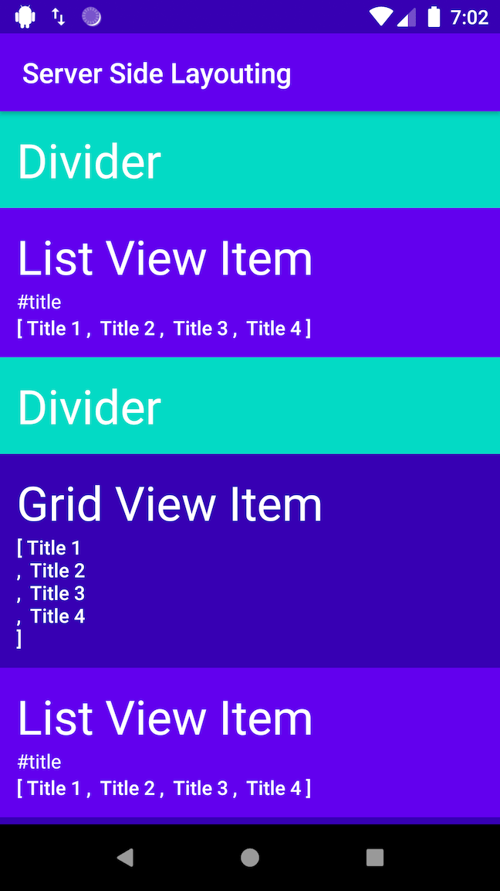

# Description

Server Side Layouting is an idea where client, like Android, can render a markup file to a native view.
Similar to how HTML is rendered nicely on browser, regardless of the browser's operating system.
This repository is a proof of concept that we can render a markup file (JSON) to Android's `RecyclerView`.

I tried to make the code as agnostic as possible so that you can apply it in your project.
In order to improve clarity, I use a fictional news reading app use case that has different type of view.
Such as `divider` and the article for the news in the form of `grid` and `list`.

## Illustration

Convert this JSON:

```json
[
  {
    "layoutType": "DIVIDER",
    "data": {}
  },
  {
    "layoutType": "LIST",
    "data": {
      "articleList": [
        {
          "articleHash": "articleHash",
          "articleId": 0,
          "commentCount": 0,
          "publishTime": 0,
          "publisher": "publisher",
          "thumbnailHash": "thumbnail hash",
          "title": "Title 1"
        },
        {
          "articleHash": "articleHash",
          "articleId": 0,
          "commentCount": 0,
          "publishTime": 0,
          "publisher": "publisher",
          "thumbnailHash": "thumbnail hash",
          "title": "Title 2"
        },
        {
          "articleHash": "articleHash",
          "articleId": 0,
          "commentCount": 0,
          "publishTime": 0,
          "publisher": "publisher",
          "thumbnailHash": "thumbnail hash",
          "title": "Title 3"
        },
        {
          "articleHash": "articleHash",
          "articleId": 0,
          "commentCount": 0,
          "publishTime": 0,
          "publisher": "publisher",
          "thumbnailHash": "thumbnail hash",
          "title": "Title 4"
        }
      ],
      "title": "#title"
    }
  },
  {
    "layoutType": "DIVIDER",
    "data": {}
  },
  {
    "layoutType": "GRID",
    "data": [
      {
        "articleHash": "articleHash",
        "articleId": 0,
        "commentCount": 0,
        "publishTime": 0,
        "publisher": "publisher",
        "thumbnailHash": "thumbnail hash",
        "title": "Title 1"
      },
      {
        "articleHash": "articleHash",
        "articleId": 0,
        "commentCount": 0,
        "publishTime": 0,
        "publisher": "publisher",
        "thumbnailHash": "thumbnail hash",
        "title": "Title 2"
      },
      {
        "articleHash": "articleHash",
        "articleId": 0,
        "commentCount": 0,
        "publishTime": 0,
        "publisher": "publisher",
        "thumbnailHash": "thumbnail hash",
        "title": "Title 3"
      },
      {
        "articleHash": "articleHash",
        "articleId": 0,
        "commentCount": 0,
        "publishTime": 0,
        "publisher": "publisher",
        "thumbnailHash": "thumbnail hash",
        "title": "Title 4"
      }
    ]
  }
]
```

To this:



# Unit Test

```kotlin
@Test
fun jsonToViewItem() {
    // Given
    val json = ResponseJson.get()
    val repository = ViewItemStubRepository()

    // When
    val viewItems = repository.getViewItems(json)

    // Then - Correct View Item
    assertTrue(viewItems.first() is DividerViewItem)
    assertTrue(viewItems[1] is ListViewItem)
    assertTrue(viewItems[2] is DividerViewItem)
    assertTrue(viewItems[3] is GridViewItem)

    // Then - Correct Data Type 1
    val listViewItem = viewItems[1] as ListViewItem
    assertTrue(listViewItem.title == "#title")
    assertTrue(listViewItem.articleList.first().title == "Title 1")

    // Then - Correct Data Type 2
    val gridViewItem = viewItems[3] as GridViewItem
    assertTrue(gridViewItem.articleList.first().title == "Title 1")
}

@Test
fun screenSectionListToViewItem() {
    // Given
    val screenSectionList = StubResponseCreator.getScreenSectionList()
    val repository = ViewItemStubRepository()

    // When
    val viewItems = repository.convertScreenSectionToViewItem(screenSectionList)

    // Then - Correct View Item
    assertTrue(viewItems.first() is DividerViewItem)
    assertTrue(viewItems[1] is ListViewItem)
    assertTrue(viewItems[2] is DividerViewItem)
    assertTrue(viewItems[3] is GridViewItem)

    // Then - Correct Data Type 1
    val listViewItem = viewItems[1] as ListViewItem
    assertTrue(listViewItem.title == "#title")
    assertTrue(listViewItem.articleList.first().title == "Title 1")

    // Then - Correct Data Type 2
    val gridViewItem = viewItems[3] as GridViewItem
    assertTrue(gridViewItem.articleList.first().title == "Title 1")
}
```

## Conversion logic

```kotlin
data class ScreenSection(
    val layoutType: ScreenSectionLayoutType,
    val data: Any = Any()
)

enum class ScreenSectionLayoutType {
    DIVIDER,
    LIST,
    GRID
}

@VisibleForTesting
fun convertScreenSectionToViewItem(screenSectionList: List<ScreenSection>): List<ViewItem> {
    return screenSectionList.map { section ->
        when (section.layoutType) {
            ScreenSectionLayoutType.DIVIDER -> DividerViewItem()
            ScreenSectionLayoutType.GRID -> getGridViewItem(section.data)
            ScreenSectionLayoutType.LIST -> getListViewItem(section.data)
        }
    }
}

private fun getGridViewItem(data: Any): GridViewItem {
    return GridViewItem(
        articleList = data as List<ArticleResponse>
    )
}

private fun getListViewItem(data: Any): ListViewItem {
    val titleAndArticlesResponse: TitleAndArticlesResponse = data as TitleAndArticlesResponse
    return ListViewItem(
        title = titleAndArticlesResponse.title,
        articleList = titleAndArticlesResponse.articleList
    )
}
```
